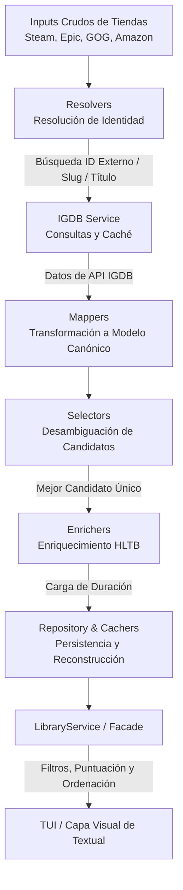

# Documentación Técnica de Puntueitor 🎮

¡Bienvenido a la documentación técnica oficial de **Puntueitor**! Este documento está diseñado para proporcionar a cualquier equipo de desarrollo que se incorpore al proyecto una comprensión clara, detallada y exhaustiva de la arquitectura, los módulos, el flujo de datos y los patrones de diseño que componen el núcleo (*core*) del sistema.

Puntueitor es una herramienta de organización, catalogación y recomendación inteligente de videojuegos. Permite unificar bibliotecas de juegos de múltiples plataformas (Steam, GOG, Epic Games y Amazon), enriquecerlas con información detallada de duración (mediante **HowLongToBeat**) y valoraciones (mediante **IGDB**), persistir las preferencias del usuario y calcular una recomendación inteligente personalizada mediante algoritmos de puntuación multi-criterio.

---

## 🗺️ Índice de Contenidos
1. [🏗️ Arquitectura General y Flujo de Datos](#️-arquitectura-general-y-flujo-de-datos)
2. [📁 Estructura del Proyecto](#-estructura-del-proyecto)
3. [🧩 Detalle de Módulos (Core)](#-detalle-de-módulos-core)
   - [3.1. core/models: Modelos de Dominio](#31-coremodels-modelos-de-dominio)
   - [3.2. core/protocols: Abstracciones e Interfaces](#32-coreprotocols-abstracciones-e-interfaces)
   - [3.3. core/config: Configuración Centralizada](#33-coreconfig-configuración-centralizada)
   - [3.4. core/cachers: Sistema de Caching Relacional y Separado](#34-corecachers-sistema-de-caching-relacional-y-separado)
   - [3.5. core/resolvers: Resolución de Identidades Externas](#35-coreresolvers-resolución-de-identidades-externas)
   - [3.6. core/mappers: Mapeo de Datos Crudos](#36-coremappers-mapeo-de-datos-crudos)
   - [3.7. core/filters: Reglas de Filtrado](#37-corefilters-reglas-de-filtrado)
   - [3.8. core/scoring: Motores de Recomendación y Puntuación](#38-corescoring-motores-de-recomendación-y-puntuación)
   - [3.9. core/selector: Desambiguación de Candidatos](#39-coreselector-desambiguación-de-candidatos)
   - [3.10. core/heroics: Integración con Heroic Games Launcher](#310-coreheroics-integración-con-heroic-games-launcher)
   - [3.11. core/index: Indexación y Fuzzy Matching](#311-coreindex-indexación-y-fuzzy-matching)
   - [3.12. core/repository: Capa de Persistencia y Reconstrucción](#312-corerepository-capa-de-persistencia-y-reconstrucción)
   - [3.13. core/pipeline: Orquestación del Flujo](#313-corepipeline-orquestación-del-flujo)
   - [3.14. core/services: Capa de Servicio / Facada de API](#314-coreservices-capa-de-servicio--facada-de-api)
   - [3.15. core/sorting: Ordenación de Biblioteca](#315-coresorting-ordenación-de-biblioteca)
4. [🔌 Submódulo Externo: steampy](#-submódulo-externo-steampy)
5. [💎 Patrones de Diseño Clave](#-patrones-de-diseño-clave)
6. [🚀 Guía de Extensión para Nuevos Desarrolladores](#-guía-de-extensión-para-nuevos-desarrolladores)

---

## 🏗️ Arquitectura General y Flujo de Datos

Puntueitor sigue un diseño arquitectónico basado en **Domain-Driven Design (DDD)** simplificado y los principios **SOLID**. El sistema separa estrictamente los datos de las plataformas externas de la representación canónica del dominio.

El flujo de vida del procesamiento de una biblioteca transcurre de la siguiente manera:



### 🏆 La Regla de Oro del Caching y la Persistencia
Para garantizar el rendimiento sin violar la integridad de los datos, Puntueitor opera bajo un principio fundamental:
* **Datos Canónicos y de Terceros**: Las especificaciones universales de un juego (géneros, portada, sinopsis, puntuación agregada de crítica/usuarios e ID de IGDB) son datos inmutables del catálogo global de IGDB. Se persisten en una base de datos de caché global (`~/.cache/puntueitor/puntueitor.db`).
* **Datos y Estados del Usuario**: Las preferencias y estados de interacción del usuario (si el juego está terminado, favorito, oculto o en el backlog) son específicos de su perfil personal. Se guardan de forma aislada en `~/.config/puntueitor/library.sqlite`.
* **Reconstrucción Dinámica**: La clase `LibraryRepository` une de forma transparente ambas fuentes de datos para reconstruir la entidad `Library` en memoria al iniciar la aplicación.

---

## 📁 Estructura del Proyecto

A nivel de ficheros, la capa lógica y de negocio se organiza en `puntueitor/core/`:

```text
puntueitor/core/
├── cachers/            # Persistencia de respuestas de red y asignaciones
├── config.py           # Gestión del singleton de configuración del usuario
├── enrichers/          # Módulos para complementar el modelo canónico (HLTB)
├── filters/            # Predicados puros para colecciones de juegos
├── heroics/            # Integración con el Launcher Heroic (Epic, GOG, Amazon)
├── igdb/               # Motor de consulta de IGDB (con autenticación automática)
├── index/              # Índices de sólo lectura y algoritmos fuzzy-match
├── mappers/            # Traductores de esquemas externos a modelos de dominio
├── models/             # Clases de datos del dominio (inmutables y mutables)
├── pipeline/           # Orquestación y paralelismo en hilos para cargas pesadas
├── protocols/          # Interfaces estables (Protocols de PEP 544)
├── raw/                # Estructuras de datos crudos específicas de plataformas
├── repository/         # Coordinación de carga e hidratación del dominio
├── resolvers/          # Conectores individuales por tienda contra IGDB
├── scoring/            # Lógica matemática de puntuación de juegos
├── selector/           # Estrategias para elegir un juego en caso de colisión
├── services/           # Fachada de la API de negocio y operaciones agrupadas
└── sorting/            # Criterios y algoritmos de ordenación
```

---

## 🧩 Detalle de Módulos (Core)

### 3.1. core/models: Modelos de Dominio
Define la ontología y las estructuras de datos principales del sistema. Están implementados mediante `dataclasses` con optimizaciones de memoria (`slots=True`).

* **`Game` (`game.py`)**: Representa la entidad central. Almacena la identidad canónica (`igdb_id`), la humana (`title`, `title_normalized`), metadatos del dominio (`genres`, `storyline`, `release_date`, `cover_url`), métricas atómicas (`critic_score`, `user_score`, `duration_hours`, y los nuevos campos de comunidad **`steam_score`** y **`steam_review`**), mapeos con tiendas (`stores`: `StoreMap`) y estados del usuario (`finished`, `hidden`, `backlog`, `favorite`).
  * *Comportamiento*: Al crearse (en `__post_init__`), normaliza automáticamente el título para realizar comparaciones seguras. Permite exportarse e importarse mediante diccionarios (`to_dict` y `from_dict`) para serialización simple.
* **`Library` (`library.py`)**: Contenedor inmutable que actúa como colección de objetos `Game`. Implementa interfaces de secuencia estándar de Python (`__iter__`, `__len__`, `contains_igdb_id`).
* **`ScoredGame` (`scored_game.py`)**: Objeto valor que asocia un juego (`Game`) con una calificación flotante calculada en un contexto específico (`score`).
* **`ScoredLibrary` (`scored_library.py`)**: Colección ordenada de `ScoredGame` que ofrece algoritmos de ordenación interna con tolerancia a valores nulos (enviándolos opcionalmente al final de la cola).
* **`ScoringContext` (`scoring_context.py`)**: Contenedor inmutable que lleva los parámetros del usuario para alimentar las decisiones de las funciones de scoring (ej. horas disponibles para jugar, géneros preferidos u odiados, pesos de decaimiento temporal).
* **`SelectionContext` (`selection_context.py`)**: Metadata necesaria para que los algoritmos de resolución y selección identifiquen juegos de manera unívoca a través de ID externos.
* **`util.py`**: Métodos estáticos de normalización de cadenas de texto (eliminando subtítulos automáticos como "GOTY", "Remastered", "Deluxe", etc.) y cálculo de ratios de similitud de texto utilizando `difflib.SequenceMatcher`.

---

### 3.2. core/protocols: Abstracciones e Interfaces
Define el núcleo tipado del proyecto mediante `typing.Protocol` (tipado estructural o *duck typing* estático). Permite un desacoplamiento absoluto de los módulos lógicos, facilitando su testeo aislado mediante mocks o stubs.

```python
class GameFilter(Protocol):
    def matches(self, game: Game) -> bool: ...

class GameScorer(Protocol):
    def score(self, game: Game, ctx: ScoringContext) -> float: ...

class GameSelector(Protocol):
    def select(self, candidates: Sequence[Game], ctx: SelectionContext) -> Game | None: ...

@runtime_checkable
class GameEnricher(Protocol):
    def enrich(self, game: Game) -> Game: ...

class GameSorter(Protocol):
    def sort(self, library: Library) -> Library: ...
```

---

### 3.3. core/config: Configuración Centralizada
* **`Config`**: Data class que define el esquema de configuración del sistema (claves de Steam, IGDB, estados activos de integración de las tiendas Epic, GOG, Amazon y pesos de los algoritmos de scoring).
* **`ConfigManager`**: Administrador implementado mediante el patrón **Singleton thread-safe** (usa `threading.Lock`). Carga y guarda de forma atómica la configuración del usuario en formato JSON en `~/.config/puntueitor/config.json`. Si no existe, inicializa una plantilla con valores por defecto equilibrados.

---

### 3.4. core/cachers: Sistema de Caching Relacional y Separado
Módulo de almacenamiento que evita llamadas redundantes a APIs de terceros, garantizando que Puntueitor pueda cargarse y ejecutarse completamente sin conexión a internet si la base de datos local está populada.

* **`IGDBCacher` (`igdb_cacher.py`)**: Gestiona la tabla `games` de SQLite. Almacena las respuestas JSON crudas indexadas por `igdb_id` e incluye la columna **`steam_id`** (extraído y cacheado desde el objeto `external_games` de IGDB).
* **`ResolversCacher` (`resolvers_cacher.py`)**: Mantiene la tabla relacional de correlación `resolvers`. Conecta de forma n-a-n juegos de tiendas externas (`store_name`, `store_game_id`) con su correspondiente identidad unificada en `igdb_id`.
* **`ExtrasCacher` (`extras_cacher.py`)**: Guarda información adicional no provista por IGDB (como horas de juego calculadas por HowLongToBeat, y los nuevos campos **`steam_score`** y **`steam_review`**) en la tabla `extras` usando combinación selectiva mediante `COALESCE`.
* **`DesconocidosCacher` (`desconocidos_cacher.py`)**: Cachea asignaciones fallidas bajo la tabla `desconocidos`. Si un juego no tiene correlación en IGDB, se registra aquí para no ralentizar futuras cargas repitiendo la búsqueda externa.
* **`SteamUserCacher` (`steam_user_cacher.py`)**: Gestiona la caché SQLite de la librería particular de un usuario de Steam (`cache/{steam_id}.sqlite`), manteniendo la lista de juegos comprados y sus tiempos de juego individuales.
* **`LibraryCacher` (`library_cacher.py`)**: Persiste los campos editables por el usuario (favorito, terminado, backlog, oculto) de forma aislada en `~/.config/puntueitor/library.sqlite`.

---

### 3.5. core/resolvers: Resolución de Identidades Externas
Los Resolvers toman un diccionario crudo provisto por una tienda externa (que contiene strings informales o identificadores propietarios) e intentan localizar las entradas equivalentes en IGDB. Todos heredan de `BaseResolver`.

> [!NOTE]
> Cada Resolver implementa estrategias inteligentes adaptadas a las peculiaridades de cada tienda:

1. **`SteamIGDBResolver` (`steam_resolver.py`)**:
   * *Estrategia*: Utiliza la API relacional de IGDB para buscar mediante `external_games.external_game_source = 1` (Steam) y la ID de la aplicación de Steam.
   * *Fallback*: Si la búsqueda directa falla, realiza una búsqueda por título acortado y normalizado.
2. **`GOGHeroicResolver` (`gog_resolver.py`)**:
   * *Estrategia*: Consulta a IGDB usando `external_game_source = 5` (GOG) con la ID nativa provista por Heroic Launcher.
   * *Fallback*: Si falla, recurre a búsqueda textual directa.
3. **`EpicHeroicResolver` (`epic_resolver.py`)**:
   * *Estrategia*: Epic no tiene una correlación de ID estática tan directa. El resolver extrae el *slug* único de la URL del juego (ej. `https://www.epicgames.com/store/product/hades` -> `hades`) y busca el juego en IGDB por dicho identificador slug.
   * *Fallback*: Búsqueda textual fuzzy evaluando con el algoritmo de similitud matemática de títulos el mejor resultado.
4. **`AmazonHeroicResolver` (`amazon_resolver.py`)**:
   * *Estrategia*: Realiza una búsqueda textual amplia por título del juego contra IGDB (máximo 10 candidatos).
   * *Resolución de colisiones*: Compara el timestamp de lanzamiento (`releaseDate` de Amazon vs `first_release_date` en IGDB) y selecciona el candidato de IGDB con la fecha de lanzamiento más cercana para evitar colisionar secuelas o remakes.

---

### 3.6. core/mappers: Mapeo de Datos Crudos
* **`IGMapperGame` (`igdb_mapper.py`)**: Actúa como barrera anticorrupción. Traduce los diccionarios masivos y altamente anidados devueltos por la API de IGDB a la estructura limpia y tipada de `Game`. Realiza la conversión segura de timestamps Unix a objetos `datetime.date`, normaliza URLs de imágenes de portada (reemplazando miniaturas `t_thumb` por imágenes grandes `t_cover_big`) y recopila los nombres textuales de los géneros.

---

### 3.7. core/filters: Reglas de Filtrado
Módulo de lógica condicional que implementa el protocolo `GameFilter`. Se utiliza para crear búsquedas y filtros dinámicos sobre la biblioteca del usuario.

* **`NameFilter`**: Filtra juegos cuyo nombre coincida con la consulta. Implementa tres capas de validación secuencial:
  1. Búsqueda exacta de subcadena en el título normalizado.
  2. Búsqueda de subcadena en el título original sin normalizar.
  3. Fuzzy match usando similitud de distancia tipográfica (por defecto con un umbral de coincidencia del 80%).
* **`DurationFilter`**: Compara la duración estimada del juego con un límite de horas.
* **`FinishedFilter` / `FavoriteFilter` / `BacklogFilter` / `HiddenFilter`**: Filtros Booleanos directos sobre los estados asignados por el usuario.
* **`GenreFilter`**: Módulo base extensible para filtrado semántico por géneros de videojuegos.

---

### 3.8. core/scoring: Motores de Recomendación y Puntuación
Este módulo calcula el valor matemático numérico de cuán "recomendable" es un juego en base a las preferencias actuales del jugador. Todos los componentes implementan `GameScorer` devolviendo valores en el rango `[0.0, 1.0]` o coeficientes de penalización.

#### Módulos de Utilidad
* **`helpers.py`**: Proporciona la función `score_or_steam(value, steam_value)`. Si la valoración principal (de IGDB) está ausente o es igual a cero, automáticamente realiza fallback a la puntuación del juego en Steam (`steam_score`).

#### Algoritmos Atómicos
* **`CriticScoreScorer` / `UserScoreScorer`**: Normalizan las valoraciones críticas y de comunidad de la escala `0-100` a `0.0-1.0`. Ambos hacen uso de `score_or_steam` para garantizar que, si no hay datos de IGDB, se utilicen las reseñas de Steam.
* **`BasicScoreScorer`**: Calcula la media simple entre la nota de la crítica y la nota de los usuarios. Tolera datos parciales utilizando el valor alternativo o realizando fallback a las valoraciones de Steam para ambos componentes.
* **`DurationScoreScorer`**: Puntúa según la duración comparada con los ideales del usuario:
  * Si la duración está por debajo del *tiempo ideal*, devuelve `1.0`.
  * Si supera la *duración máxima*, devuelve `0.0`.
  * En el intervalo intermedio, aplica una caída lineal de la puntuación.
* **`GenreScorer`**: Suma `+1.0` por cada género preferido del usuario (normalizado por la cantidad total de géneros del juego) y penaliza drásticamente (`-1.0`) si el juego contiene géneros explícitamente marcados como odiados.

#### Algoritmos Compuestos
* **`WeightedScore`**: Permite definir una colección parametrizada de scorers individuales y sus pesos correspondientes. Calcula la suma ponderada general.
* **`CompositeGameScorer`**: Estructura de composición de scorers bajo el patrón de diseño Composite.
* **`AvailableTimeScorer`**: Diseñado para resolver el problema *"tengo exactamente X horas libres este fin de semana"*.
  * Si el juego cabe en el tiempo disponible, devuelve una valoración proporcional (priorizando los que se acerquen más al límite sin pasarse).
  * Si excede las horas disponibles, calcula un ratio de penalización excedente limitado, restando valor al juego de forma exponencial o lineal.
* **`MixedScore`**: Combina de forma equilibrada tres vectores: la nota agregada de prensa, de usuarios y un cálculo exponencial de duración:
  $$\text{duration\_norm} = e^{-\frac{\text{duración}}{\text{escala}}}$$
  Usa `score_or_steam` para la prensa y los usuarios, integrando las reseñas de Steam en la fórmula combinada. Permite priorizar juegos con valoraciones excelentes y duraciones compactas.

---

### 3.9. core/selector: Desambiguación de Candidatos
Cuando un resolver busca en IGDB un título, a menudo recibe múltiples variantes (ej. buscar "Hades" puede devolver "Hades" y "Hades II").
* **`SteamSelector` (`steam_selector.py`)**: Implementa la lógica de decisión. Evalúa la completitud de la ficha técnica (si dispone de carátula, sinopsis, horas de juego y notas) combinándolo con una puntuación atómica. El candidato con mayor nota y mayor densidad de metadatos es seleccionado automáticamente como el registro representativo.

---

### 3.10. core/heroics: Integración con Heroic Games Launcher
* **`HeroicsLoader`**: Detecta automáticamente las instalaciones de Heroic Games Launcher (buscando rutas por defecto en Flatpak, directorios del sistema de archivos `~/.config/heroic` o rutas configuradas). Lee directamente los archivos JSON locales en los que Heroic indexa las colecciones instaladas y adquiridas:
  * GOG: `store_cache/gog_library.json`
  * Epic: `store_cache/legendary_library.json`
  * Amazon: `store_cache/nile_library.json`

---

### 3.11. core/index: Indexación y Fuzzy Matching
* **`LibraryIndex`**: Clase de optimización en memoria de sólo lectura. Indexa los juegos de la librería utilizando como clave el título normalizado. Permite búsquedas instantáneas $O(1)$ por nombre y búsquedas aproximadas mediante fuzzy match ordenadas por relevancia matemática.

---

### 3.12. core/repository: Capa de Persistencia y Reconstrucción
* **`LibraryRepository`**: La interfaz encargada de orquestar la serialización del estado general de la biblioteca del usuario. Coordina múltiples cachers internos. Al invocar `.load()`, lee las asociaciones estables de la caché relacional de resolvers, busca en la tabla global las fichas de los juegos de IGDB correspondientes, inyecta las duraciones de extras, y finalmente aplica el estado del usuario (favoritos, terminados, backlog) reconstruyendo un objeto `Library` unificado listo para consumir.

---

### 3.13. core/pipeline: Orquestación del Flujo
Módulos de alto nivel para procesar la información de forma concurrente, optimizando el rendimiento de la aplicación en colecciones masivas de juegos (de más de 1000 títulos).

* **`enrichment_pipeline.py`**: Aplica en cadena una secuencia de `GameEnricher` (llamadas concurrentes a HowLongToBeat y a Steam Reviews) a una colección de juegos.
* **`filter_library.py`**: Proporciona utilidades para encadenar múltiples filtros lógicos con operadores lógicos AND / OR sobre una librería.
* **`scoring_ops.py`**: Asigna calificaciones en masa y devuelve la biblioteca ordenada según las prioridades del usuario.
* **`load_steam_library.py`**: **El motor de carga asíncrono principal**. Realiza las siguientes tareas de forma optimizada:
  * Inicia un `ThreadPoolExecutor` con hilos concurrentes de procesamiento.
  * Lee secuencialmente las bibliotecas activas en la configuración (Steam API, GOG, Epic, Amazon de Heroic).
  * Lanza callbacks de progreso en tiempo real para mantener informada la interfaz del usuario.
  * Resuelve y desambigua los juegos concurrentemente.
  * Aplica enriquecedores en segundo plano (como **`HLTBEnricher`** y el nuevo **`SteamScoreEnricher`**) para evitar bloquear el hilo principal durante peticiones web y actualiza los metadatos dinámicamente mediante callbacks de enriquecimiento (restando latencia de red al cargar y mapear `steam_score` y `steam_review` desde la base de datos local `extras` si ya están en caché).

---

### 3.14. core/services: Capa de Servicio / Facada de API
* **`LibraryService`**: Actúa como **Facade (fachada de API)**. Es el único punto de contacto que necesita consumir la interfaz visual (TUI en Textual). Agrupa métodos unificados para:
  * Cargar y guardar la biblioteca.
  * Aplicar filtros temáticos (por nombre, duración, terminados, favoritos, backlog, ocultos).
  * Ordenar la colección bajo criterios básicos o scoring dinámico.
  * Evaluar modelos de scoring ponderados y devolver mapas rápidos de ID -> Puntuación.

---

### 3.15. core/sorting: Ordenación de Biblioteca
* Estrategias individuales que implementan `GameSorter` para ordenar la biblioteca por criterios comunes: `NameSorter`, `DurationSorter`, y clasificadores por valoraciones (`CriticRatingSorter`, `UserRatingSorter`, `TotalRatingSorter`).

---

## 🔌 Submódulo Externo: steampy

El directorio `steampy/` es un cliente HTTP de bajo nivel optimizado específicamente para interactuar de forma robusta con la API de Steam Web.

* **`steam_api.py`**:
  * *Control de flujo*: Implementa un algoritmo de **Rate Limiting** dinámico basado en ventanas temporales e hilos seguros (`threading.Lock`), evitando que la clave API del usuario sea bloqueada por exceso de peticiones.
  * *Métodos*: Expone llamadas directas para obtener el número de jugadores activos concurrentes, esquemas de logros globales, información del perfil de usuario y la lista de juegos en propiedad (`owned_games`).
  * *Persistencia local*: Delega a `SteamUserCacher` para guardar de forma local en base de datos SQLite relacional los juegos adquiridos de Steam, mitigando la necesidad de realizar llamadas de red repetitivas al iniciar la aplicación.

---

## 💎 Patrones de Diseño Clave

Puntueitor destaca por el uso de patrones clásicos de la ingeniería de software:

1. **Patrón Strategy (Estrategia)**: Las fórmulas de puntuación (`MixedScore`, `WeightedScore`, `AvailableTimeScorer`) y las lógicas de ordenación heredan de protocolos unificados. La interfaz visual puede intercambiar en tiempo de ejecución la estrategia de valoración y ordenación sin modificar una sola línea de código del motor de datos.
2. **Patrón Composite (Composición)**: `WeightedScore` y `CompositeGameScorer` componen múltiples instancias de `GameScorer` permitiendo construir fórmulas matemáticas anidadas y complejas a partir de bloques muy simples y fáciles de probar.
3. **Patrón Facade (Fachada)**: `LibraryService` simplifica el acceso a todo el subsistema del core (caching, repositorios, filtros, scoring, pipelines) en una sola clase limpia y legible, aislando la interfaz TUI basada en Textual de los detalles de bajo nivel.
4. **Patrón Repository (Repositorio)**: `LibraryRepository` oculta la complejidad asociada a consultar múltiples tablas de bases de datos SQLite separadas e integrar llamadas HTTP de APIs externas, exponiendo al resto de la aplicación métodos intuitivos de lectura y escritura (`load` y `save`).
5. **Barrera Anticorrupción (Mappers)**: `IGMapperGame` protege al core contra cambios inesperados en los formatos JSON que devuelven las APIs de terceros (ej. cambios en las claves de las APIs de IGDB o Steam).

---

## 🚀 Guía de Extensión para Nuevos Desarrolladores

Si te unes al equipo de Puntueitor, aquí tienes plantillas sencillas para añadir nuevas funcionalidades sin alterar el núcleo de la arquitectura:

### 1. ¿Cómo añadir una nueva Tienda/Plataforma de Juegos?
1. Añade tu tienda al Enum `Stores` en [game.py](file:///home/deck/Proyectos/puntueitor/puntueitor/core/models/game.py).
2. Crea un resolver que herede de `BaseResolver` en [resolvers/](file:///home/deck/Proyectos/puntueitor/puntueitor/core/resolvers/) (ej. `NintendoResolver`). Implementa el método `resolve(self, raw: dict, refresh: bool) -> Sequence[Game]`.
3. Integra tu cargador y resolver dentro del pipeline de carga concurrente en [load_steam_library.py](file:///home/deck/Proyectos/puntueitor/puntueitor/core/pipeline/load_steam_library.py).

### 2. ¿Cómo crear una nueva Fórmula de Puntuación (Scoring)?
1. Crea una clase que implemente el protocolo `GameScorer` en la carpeta [scoring/atomic/](file:///home/deck/Proyectos/puntueitor/puntueitor/core/scoring/atomic/) (o en `scoring/` si es compuesta).
2. Implementa el método `score(self, game: Game, ctx: ScoringContext) -> float`, asegurando devolver un valor decimal normalizado.
3. Registra tu nueva clase en el método `_get_scorer` de [library_service.py](file:///home/deck/Proyectos/puntueitor/puntueitor/core/services/library_service.py) para que la interfaz gráfica pueda invocarla de inmediato.

### 3. ¿Cómo añadir un nuevo Enriquecedor (GameEnricher)?
1. Crea una clase que implemente la interfaz `GameEnricher` en la carpeta [enrichers/](file:///home/deck/Proyectos/puntueitor/puntueitor/core/enrichers/) (ej. el nuevo **`SteamScoreEnricher`** en `steam_score_enricher.py`).
2. Implementa el método `enrich(self, game: Game) -> Game` que retorna una versión enriquecida del juego (puedes apoyarte en `dataclasses.replace`).
3. Instancia tu enriquecedor e incorpóralo en la lista de enriquecedores en [load_steam_library.py](file:///home/deck/Proyectos/puntueitor/puntueitor/core/pipeline/load_steam_library.py) para que forme parte del hilo asíncrono de enriquecimiento de carga de biblioteca.

---

*Desarrollado con pasión. Diseñado para durar.* 🚀
