<p align="center">
  
  
  
  
  
</p>

<h1 align="center">🎮 Puntueitor</h1>

<p align="center">
  <b>Centraliza, gestiona y optimiza la elección de tus próximas partidas basándose en tus bibliotecas actuales</b><br>
  Unifica Steam, GOG, Epic Games y Amazon en <b>dos interfaces</b>: una de terminal
  y un carrusel 3D pensado para el mando.<br>
  Enriquecimiento automático, filtros, puntuación multi-criterio y persistencia.
</p>

---

## 📸 Capturas

### 🖥️ Interfaz de terminal

<p align="center">
  <i>Biblioteca principal con lista de juegos, detalle y barra de estado</i><br>
  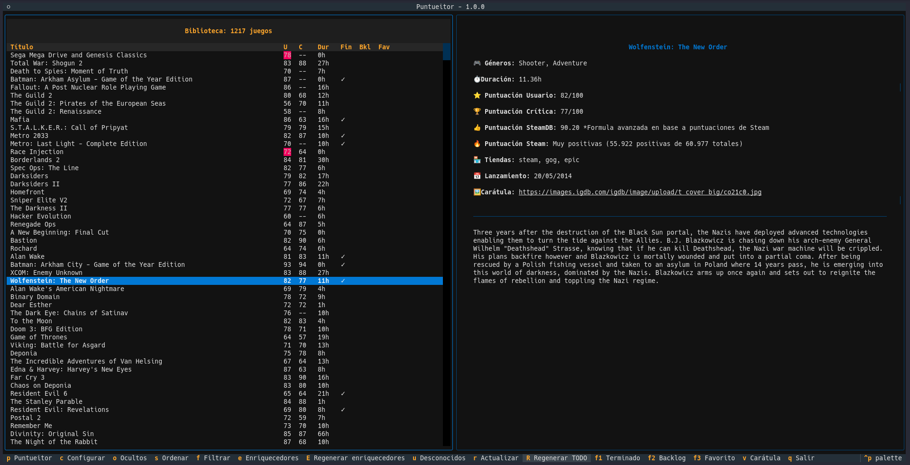
</p>

<p align="center">
  <i>Diálogo de puntuación con previsualización</i><br>
  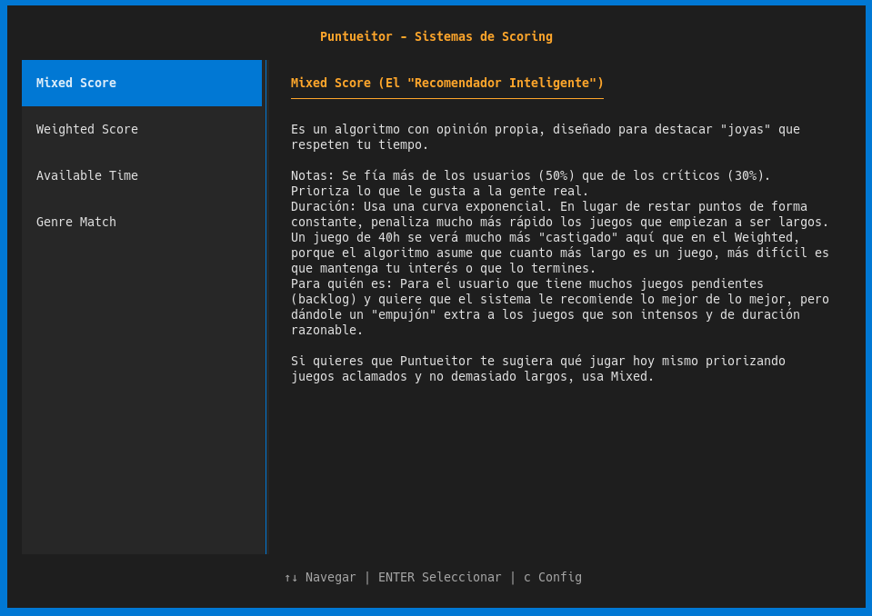
</p>

<p align="center">
  <i>Biblioteca recomendada por Puntueitor</i><br>
  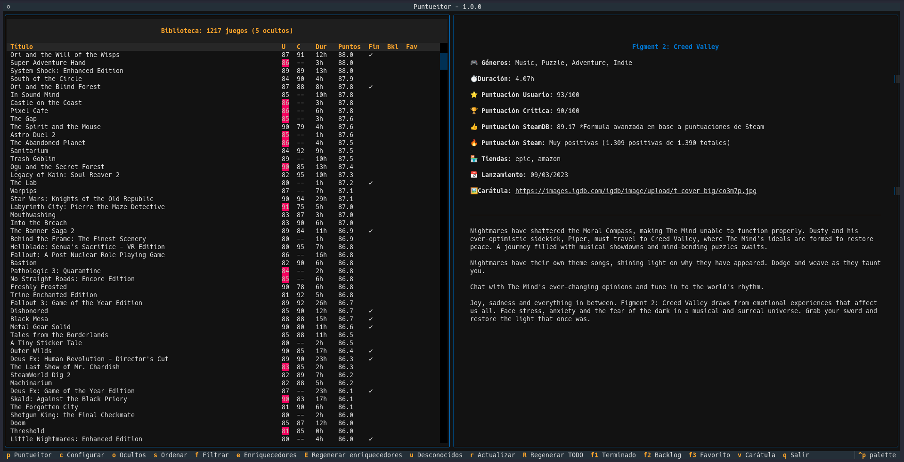
</p>

<p align="center">
  <i>Configuración de tiendas y credenciales</i><br>
  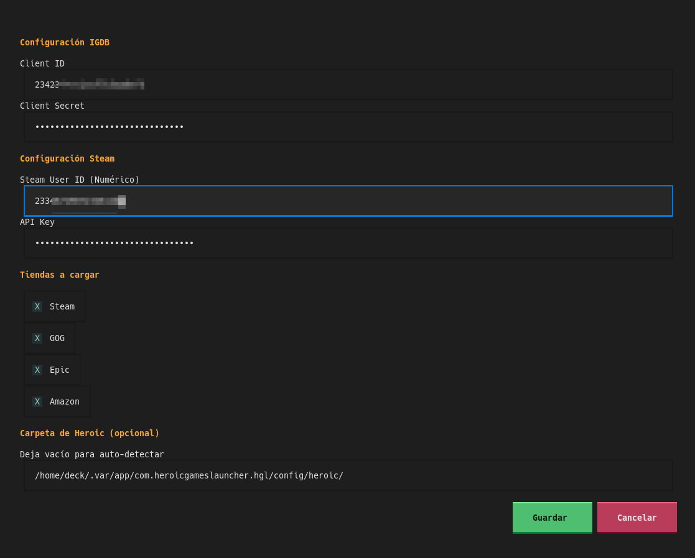
</p>

### 🎠 Carrusel 3D

<p align="center">
  <i>Las cajas de tus juegos en arco, con la ficha del seleccionado debajo</i><br>
  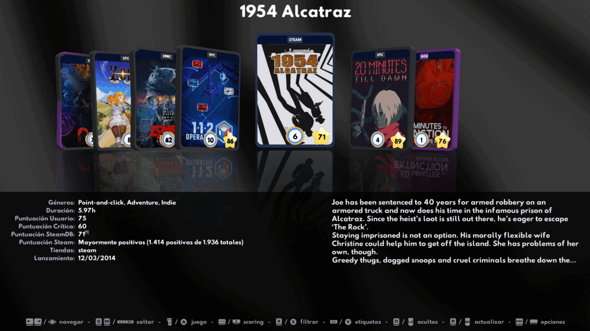
</p>

<p align="center">
  <i>Menú del juego: estados de usuario y acciones avanzadas</i><br>
  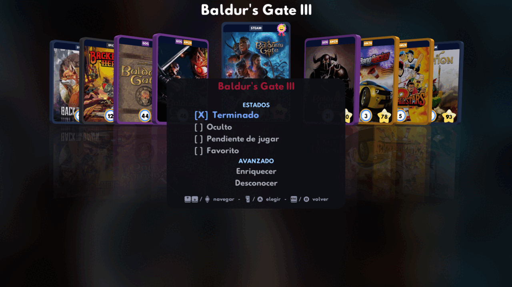
</p>

<p align="center">
  <i>Los mismos sistemas de puntuación que la TUI, con su descripción</i><br>
  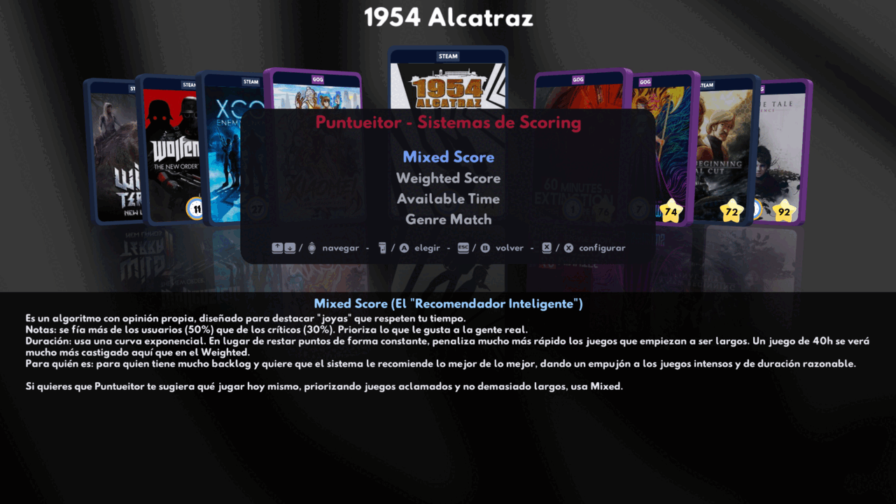
</p>

<p align="center">
  <i>Editor Rápido: marcar estados con el stick derecho, sin abrir menús</i><br>
  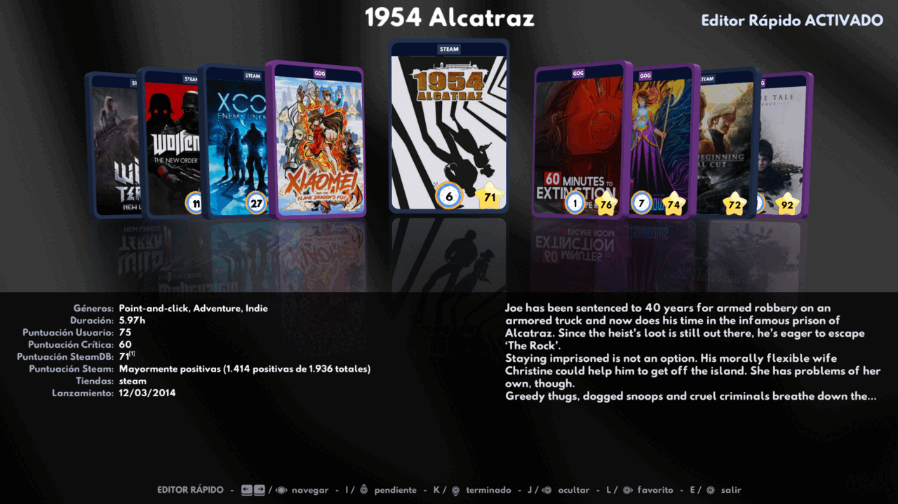
</p>

<p align="center">
  <i>Opciones → Avanzado: lo que no es de todos los días, en dos secciones</i><br>
  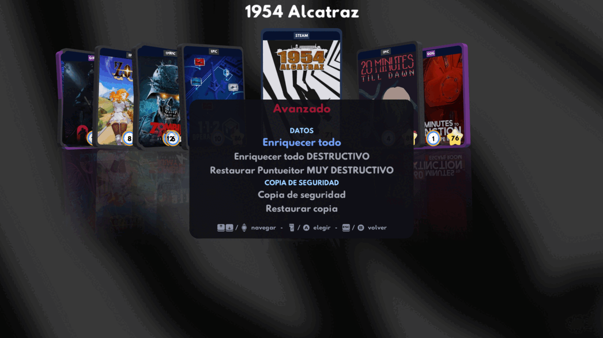
</p>

<p align="center">
  <i>Las acciones destructivas avisan de lo que se pierde</i><br>
  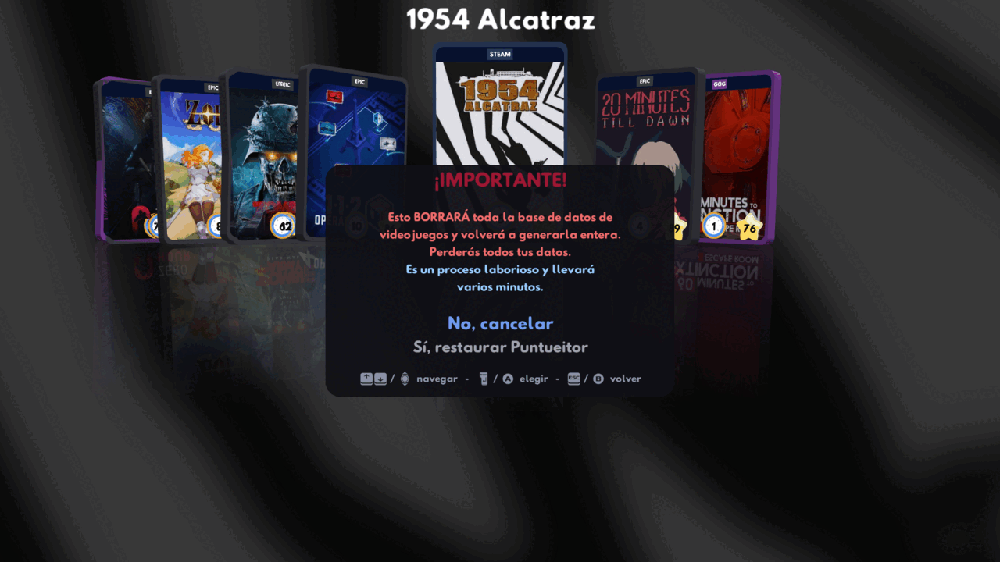
</p>

<p align="center">
  <i>Créditos: iconos, tipografías y de dónde salen los datos</i><br>
  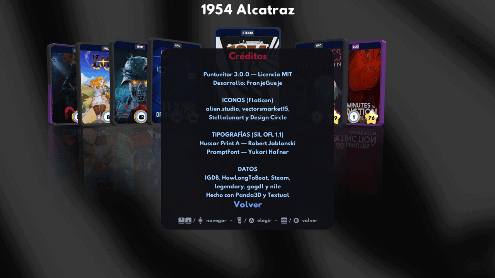
</p>

> Las del carrusel se regeneran con `python tools/capturas3d.py`, que dibuja
> sin abrir ventana.

---

## ✨ Características

| Característica | Detalle |
|---|---|
| **Dos interfaces** | TUI de terminal (Textual) y carrusel 3D (Panda3D), sobre la misma biblioteca |
| **Multi-tienda** | Steam, GOG, Epic Games y Amazon, cada una por su propia API |
| **Sin conexión** | La última biblioteca de cada tienda queda guardada: si no hay red, tus juegos siguen ahí |
| **Enriquecimiento IGDB** | Carátula, género, puntuación de crítica, storyline, fecha de lanzamiento |
| **Duración** | HowLongToBeat — búsqueda automática por similitud de título |
| **Valoración Steam** | Puntuación SteamDB bayesiana + recuento de reseñas positivas/negativas |
| **Sistemas de scoring** | Mixto (critic + user + duración), Ponderado, Tiempo Disponible, Género |
| **Filtros** | Nombre, duración máxima, flags de usuario |
| **Flags de usuario** | Terminado, Backlog, Favorito, Oculto — persistidos en SQLite |
| **Ordenación** | Por nombre, puntuación usuario, crítica, mixta, duración (asc/desc) |
| **Juegos desconocidos** | Los juegos no encontrados en IGDB se aíslan para resolución manual |
| **Resolución IGDB** | Búsqueda por título con 15 resultados, o re-resolución automática por tienda |
| **Persistencia de filtros** | Los filtros activos se guardan entre sesiones (JSON) |
| **Mando** | El carrusel se maneja entero con un mando: navegar, menús, gatillos y sticks |
| **Editor Rápido** | Marcar terminado, pendiente, oculto o favorito con el stick derecho, sin menús |
| **Actualizar sin salir** | Desde cualquiera de las dos interfaces: busca en tus tiendas y añade lo nuevo |
| **Tiendas a la carta** | Desmarcar una tienda deja de escanearla **y** de enseñar sus juegos |
| **Copias de seguridad** | Toda tu instalación en un zip, y de vuelta, desde las dos interfaces |
| **Diagnóstico claro** | El log distingue "sin internet" de "tu clave no vale" y resume cada carga |
| **Caché unificada** | Una sola base de datos SQLite en `~/.local/share/puntueitor/` |
| **Binario único** | PyInstaller — sin dependencias del sistema: 25 MB la TUI, 66 MB el carrusel |

---

## 🚀 Instalación

### Binario precompilado (Linux x86_64)

Descarga la última versión desde [Releases](https://github.com/FranjeGueje/puntueitor/releases):

```bash
chmod +x puntueitor-2.0.0-x86_64-linux
./puntueitor-2.0.0-x86_64-linux
```

### Desde fuente

```bash
git clone https://github.com/FranjeGueje/puntueitor.git
cd puntueitor
python -m venv .venv
source .venv/bin/activate
pip install -r requirements.txt
```

Con el entorno activado, cada interfaz se lanza con su módulo:

```bash
python -m puntueitor.tui.app      # interfaz de terminal (Textual)
python -m puntueitor.gui3d.app    # interfaz 3D (Panda3D)
```

> Los dos comandos necesitan el virtualenv activado (`source
> .venv/bin/activate`). Lanzarlos con el Python del sistema falla con
> `ModuleNotFoundError: No module named 'textual'` o `'panda3d'`, porque las
> dependencias se instalan dentro del entorno.

### Interfaz 3D

Un carrusel de cajas de juego con la ficha del seleccionado, navegable con
teclado o con mando. Acepta la resolución de ventana al arrancar:

```bash
python -m puntueitor.gui3d.app --hd            # 1280x720
python -m puntueitor.gui3d.app --fhd           # 1920x1080
python -m puntueitor.gui3d.app --wxga          # 1280x800  (16:10)
python -m puntueitor.gui3d.app --wuxga         # 1920x1200 (16:10)
python -m puntueitor.gui3d.app --resolution 2560x1440
```

Lee la misma biblioteca cacheada que la TUI: comparten los juegos, las
marcas de usuario (terminado, favorito, backlog, oculto) y la configuración
de scoring. Lo único que descarga son las carátulas que falten, en segundo
plano según vas navegando. Necesita una GPU con OpenGL.

Hace lo mismo que la TUI y sin salir de él: filtrar y ordenar, puntuar con
cualquiera de los cuatro sistemas, marcar estados, enriquecer un juego suelto,
desconocerlo, rescatar juegos desconocidos —buscándolos por título en IGDB o
volviendo a preguntar a su tienda—, actualizar la biblioteca y regenerarla
entera. Todo lo que tarda va en segundo plano: puedes seguir navegando
mientras.

---

## ⚙️ Configuración

Al arrancar por primera vez, abre el diálogo de configuración —`c` en la TUI,
Select → Configuración en el carrusel— o edita a mano
`~/.config/puntueitor/config.json`. Las dos interfaces leen y escriben el
mismo fichero:

> Puntueitor sigue la especificación XDG Base Directory. Si vienes de una
> versión anterior, tus ficheros se trasladan solos al arrancar:
>
> | Directorio | Contenido |
> |---|---|
> | `~/.config/puntueitor/` | `config.json` (credenciales y tiendas) y `scoring.json` (pesos de los sistemas de puntuación) |
> | `~/.local/share/puntueitor/` | biblioteca y marcas de usuario (`puntueitor.db`, `library.sqlite`) |
> | `~/.cache/puntueitor/` | carátulas y datos re-descargables |
> | `~/.local/state/puntueitor/` | log y estado de cada interfaz (`tui.json`, `gui3d.json`) |
>
> La biblioteca ya no vive en `~/.cache`: ahí un limpiador de disco podía
> borrarla, y casi nadie incluye esa carpeta en sus copias de seguridad.

| Campo | Tipo | Descripción |
|---|---|---|
| `steam_api_key` | `string` | API Key de Steam (https://steamcommunity.com/dev/apikey) |
| `steam_user_id` | `int` | Tu Steam ID numérica (SteamID64) |
| `igdb_client_id` | `string` | Client ID de Twitch/IGDB (https://dev.twitch.tv/console) |
| `igdb_client_secret` | `string` | Client Secret de Twitch/IGDB |
| `steam_is_active` | `bool` | Cargar juegos de Steam |
| `gog_is_active` | `bool` | Cargar juegos de GOG |
| `epic_is_active` | `bool` | Cargar juegos de Epic |
| `amazon_is_active` | `bool` | Cargar juegos de Amazon |
| `scoring_*` | `float/list` | Pesos de puntuación y géneros preferidos |

> Las cuatro banderas `*_is_active` deciden dos cosas: **de qué tiendas se
> escanea** y **qué juegos se enseñan**. Un juego que tengas en dos tiendas se
> sigue viendo mientras una de ellas esté marcada.
>
> ⚠️ Con una tienda desmarcada, **regenerar** borra sus juegos de la base de
> datos, no solo de la vista: se vacía entera y solo se repuebla lo marcado.
> Actualizar no borra nada.

---

### 🔑 Cuentas

Cada tienda se consulta con tu propia sesión, así que hay que iniciarla una
vez. Se hace desde **Cuentas** —`a` en la TUI, Select → Configuración →
CUENTAS en el carrusel— y el gesto es el mismo en las cuatro:

1. Elige la tienda y pulsa **Abrir navegador**.
2. Inicia sesión con tu cuenta de siempre.
3. Cuando termines, **copia la dirección de la barra** de la página a la que
   te lleva y pégala en Puntueitor. En Epic vale también el texto que enseña
   esa página.
4. Refresca la biblioteca (`r`).

No hace falta buscar nada dentro de la dirección: se pega entera. Si no hay
navegador que abrir —por SSH, o en el modo juego del Deck—, la dirección
queda en el log para que la abras donde puedas.

> **Para pegar en el carrusel 3D**: `Ctrl+V`, o el botón **X** del mando. Las
> direcciones de vuelta pasan de los cuatrocientos caracteres y teclearlas
> con un mando no es plan.
>
> Panda3D no da acceso al portapapeles, así que se le pregunta al sistema:
> `wl-paste`, `xclip` o `xsel` si los tienes, y si no a Klipper por D-Bus,
> que en KDE Plasma **funciona sin instalar nada**. Donde no haya ninguna de
> las dos cosas (el modo juego del Deck, por ejemplo) el aviso lo dice en vez
> de quedarse callado.

**Steam necesita además una API key**, que Valve solo entrega a mano: sácala
de [steamcommunity.com/dev/apikey](https://steamcommunity.com/dev/apikey) y
pégala en Configuración. Entrar por Cuentas te ahorra teclear el Steam ID,
que es lo que más se equivoca. Y recuerda que tu perfil y los detalles de
juego tienen que estar en **público** para que Steam los sirva.

> Los tokens se guardan en `~/.cache/puntueitor/` y se renuevan solos. Si se
> pierden, lo único que pasa es que hay que volver a entrar.

> **Sin conexión:** la última biblioteca de cada tienda queda guardada. Si no
> hay red, la sesión ha caducado o la tienda no contesta, Puntueitor sirve
> los juegos de la última vez y lo dice en el log, en vez de dejarte la
> biblioteca vacía. Un refresco vuelve a preguntar.

---

## ⌨️ Controles

### Interfaz de terminal

| Tecla | Acción | Descripción |
|---|---|---|
| `p` | **Puntueitor** | Abre selector de sistema de puntuación |
| `c` | **Configurar** | Diálogo de configuración de API keys y tiendas |
| `a` | **Cuentas** | Iniciar o cerrar sesión en Steam, GOG, Epic y Amazon |
| `o` | **Ocultos** | Alterna visibilidad de juegos marcados como ocultos |
| `s` | **Ordenar** | Diálogo de ordenación (nombre, puntuación, duración…) |
| `f` | **Filtrar** | Diálogo de filtros (nombre, duración, flags…) |
| `e` | **Enriquecedores** | Ejecuta HLTB + Steam Score en toda la biblioteca |
| `E` | **Regenerar** | Limpia caché de enriquecedores y vuelve a ejecutar |
| `u` | **Desconocidos** | Alterna vista de juegos desconocidos / biblioteca |
| `r` | **Actualizar** | Recarga tiendas desde API (juegos nuevos) |
| `R` | **Regenerar TODO** | Borra toda la caché SQLite y recarga desde cero |
| `F1` | **Terminado** | Marca/desmarca el juego seleccionado como terminado |
| `F2` | **Backlog** | Marca/desmarca el juego seleccionado como backlog |
| `F3` | **Favorito** | Marca/desmarca el juego seleccionado como favorito |
| `v` | **Carátula** | Abre la carátula del juego en el visor de imágenes del sistema |
| `b` | **Copia de seguridad** | Guarda toda tu instalación en un zip (por defecto, en el escritorio) |
| `B` | **Restaurar copia** | Vuelca un zip sobre tus datos actuales y cierra la aplicación |
| `q` | **Salir** | Cierra la aplicación |

### En diálogos modales

| Tecla | Acción |
|---|---|
| `↑`/`↓` | Navegar entre opciones |
| `Enter` | Seleccionar / Aceptar |
| `Escape` | Cancelar / Volver |
| `Letra` resaltada | Atajo directo a la opción (mayúscula = descendente) |

### Carrusel 3D

| Teclado | Mando | Acción |
|---|---|---|
| `←` `→` | Stick / cruceta | Navegar por la biblioteca |
| `Q` `W` | `L1` `R1` | Saltar al grupo anterior/siguiente (letra o tramo de nota) |
| `Inicio` | `L3` | Volver al principio del carrusel |
| `E` | `R3` | Entrar y salir del **Editor Rápido** |
| `Enter` | `A` | Menú del juego: estados, enriquecer, desconocer |
| `Esc` | `B` | Volver |
| `Esc` | `Select` | Opciones (configuración, ajustes del carrusel, avanzado, créditos, salir) |
| `Tab` | `Start` | Puntueitor: sistemas de puntuación |
| `X` | `X` | Filtrar y ordenar |
| `Espacio` | `Y` | Mostrar u ocultar las etiquetas de las cajas |
| `O` | `L2` | Mostrar u ocultar los juegos marcados como ocultos |
| `R` | `R2` | Actualizar la biblioteca: busca en tus tiendas y añade lo nuevo |
| `↑` | Stick / cruceta arriba | Juegos desconocidos |
| `↓` | Stick / cruceta abajo | Volver a la biblioteca |

En los menús, `↑`/`↓` navegan, `←`/`→` cambian los valores que los tienen
(pesos, horas, filtros de tres estados) y `A` elige. La barra de abajo recuerda
en todo momento qué hace cada botón.

### Editor Rápido

Marcar estados juego a juego sin abrir ningún menú, que es lo que la TUI hace
con `F1`/`F2`/`F3`. Se entra y se sale con `R3` o con `E`, solo desde el
carrusel de la biblioteca, y mientras está activo el resto de menús avisan de
que hay que salir primero (siguen funcionando navegar, `Y` etiquetas y `L2`
ocultos).

| Stick derecho | Tecla | Estado |
|---|---|---|
| ↑ | `I` | Pendiente de jugar |
| ↓ | `K` | Terminado |
| ← | `J` | Oculto |
| → | `L` | Favorito |

Ocultar un juego se aplica **al salir** del modo, no al momento: si no, la caja
que acabas de marcar desaparecería de debajo y la selección saltaría a otra
mientras sigues editando.

**Opciones → Avanzado** guarda lo que no es de todos los días: enriquecer todo
(en sus dos versiones, la que escribe encima y la que borra antes), regenerar
todo, y la **copia de seguridad** y su restauración. Cada operación que pierde
algo lo avisa antes, en rojo.

### Copias de seguridad

Disponible en las dos interfaces (`b` y `B` en la TUI, Avanzado en el
carrusel). El zip lleva las cuatro carpetas de Puntueitor: la configuración con
tus claves, las dos bases de datos —incluidos los estados de tu biblioteca, que
no se pueden recuperar de ninguna API— y las carátulas ya descargadas. Se
propone guardarlo en el escritorio.

Al restaurar se sobrescriben los datos actuales y la aplicación se cierra:
tiene las bases abiertas mientras corre, así que hay que volver a abrirla para
que lea lo recuperado.

---

## 🏗️ Arquitectura

```
        ┌──────────────────┐   ┌──────────────────┐
        │    TUI (Textual) │   │ Carrusel (Panda3D)
        │ app, screens,    │   │ app, carousel,   │
        │ widgets          │   │ menús, workers   │
        └────────┬─────────┘   └────────┬─────────┘
                 └───────────┬──────────┘
                             │
              ┌──────────────┴───────────┐
              │  Servicios compartidos    │
              │  game_actions,            │
              │  unknown_actions,         │
              │  library_refresh, backup, │
              │  library_ops, store_titles│
              └──────────────┬───────────┘
                             │
              ┌──────────────┴───────────┐
              │     LibraryService       │
              │  (fachada de operaciones)│
              └────────────┬────────────┘
                           │
        ┌──────────────────┼──────────────────┐
        │                  │                  │
   ┌────┴────┐      ┌─────┴─────┐      ┌─────┴─────┐
   │ Filters │      │  Scoring   │      │ Repository │
   │ 7 clases│      │ 4 sistemas │      │ (SQLite)   │
   └─────────┘      └─────┬─────┘      └────────────┘
                          │
              ┌───────────┴───────────┐
              │      Enrichers         │
              │  (HLTB + Steam Score)  │
              └───────────────────────┘

              ┌───────────────────────┐
              │       Cachers          │
              │ (IGDB, Extras, Steam…) │
              └───────────────────────┘

    Resolvers → Mappers → Selectors → Pipeline → Models
```

### Flujo de datos

1. **Providers** traen la biblioteca cruda de cada tienda por su API, y la guardan para poder trabajar sin conexión
2. **Resolvers** identifican cada juego crudo contra IGDB
3. **Mappers** transforman los datos crudos en objetos `Game` canónicos
4. **Filters** aplican criterios (nombre, duración, flags…) sobre la biblioteca
5. **Scoring** calcula puntuaciones multi-criterio personalizadas
6. **Selectors** desambiguan entre candidatos duplicados de distintas tiendas
7. **Enrichers** añaden metadatos (duración HLTB, puntuación SteamDB)
8. **Pipeline** orquesta todo el flujo de carga, filtrado y enrichment

Para el diseño del sistema y el porqué de sus decisiones, ver
[`arquitectura.md`](arquitectura.md). Para notas de trabajo y trampas
concretas encontradas por el camino, [`AGENTS.md`](AGENTS.md).

---

## 🧪 Tests

```bash
source .venv/bin/activate
python -m pytest tests/
```

557 tests (unitarios + integración) que cubren:
- Modelos de dominio (Game, Library, ScoredLibrary)
- Filtros (7 clases)
- Scoring (helpers, atómicos, mixto, ponderado, tiempo disponible, género)
- Selectores, Mappers, Enrichers
- Resolvers (plantilla común y las 4 tiendas)
- Proveedores de tienda: paginación, filtrado, caída a la copia guardada
  cuando no hay red y sesión caducada
- Sesiones: renovación de tokens y qué se acepta al pegar la vuelta del login
- Pegar en el carrusel: en qué orden se le pregunta al sistema por el
  portapapeles, y que el botón X acabe pegando de verdad
- Pipeline (scoring_ops, filter_library, enrichment)
- Servicios, Cachers (5 tipos), Config, Repository
- Acciones compartidas por las dos interfaces: enriquecer y desconocer un
  juego, rescatar desconocidos, actualizar y regenerar la biblioteca
- Qué juegos se enseñan según las tiendas marcadas
- Copias de seguridad: ida y vuelta, zips ajenos, rutas maliciosas dentro del
  zip y restaurar con la base de datos abierta
- Diagnóstico de errores y que el log nunca escriba una credencial
- El Editor Rápido: su tabla de gestos y la histéresis del stick derecho
  (ese test reproduce un rebote real de un mando)

Ninguno toca la red ni tus ficheros: `tests/conftest.py` monta un sandbox
antes de importar nada, y la suite se niega a arrancar si ese aislamiento no
está puesto.

Las pruebas de interfaz van aparte: necesitan una ventana (aunque sea fuera de
pantalla) y datos reales, así que no entran en `pytest`.

### Probar la aplicación sin tocar tus datos

Para probar a mano —iniciar sesión de verdad en una tienda, recargar la
biblioteca, ver qué escribe— sin arriesgar tu instalación:

```bash
tools/entorno-prueba.sh ~/pruebas-puntueitor                    # la TUI
tools/entorno-prueba.sh ~/pruebas-puntueitor --3d               # el carrusel
tools/entorno-prueba.sh ~/pruebas-puntueitor --copiar-config    # con tus credenciales
tools/entorno-prueba.sh ~/pruebas-puntueitor --shell            # una shell dentro
tools/entorno-prueba.sh ~/pruebas-puntueitor -- python -c '...' # lo que quieras
```

Todo lo que escriba la aplicación se queda dentro de ese directorio, y el
script se niega a arrancar si comprueba que alguna ruta se le ha escapado
al home de verdad.

> Fija `HOME` además de las cuatro `XDG_*`, y hacen falta las dos cosas:
> `migrate_legacy_paths()` usa `Path.home()` para el **origen** de las rutas
> antiguas, así que aislar solo con las `XDG_*` no protegería —movería tus
> ficheros reales al entorno de pruebas.

---

## 📦 Build

Un binario único auto-contenido por interfaz:

```bash
./build.sh      # → dist/puntueitor-2.0.0-x86_64-linux    (TUI)
./build3d.sh    # → dist/puntueitor3d-2.0.0-x86_64-linux  (interfaz 3D)
```

El nombre incluye versión, arquitectura y sistema automáticamente; la
versión sale de `puntueitor/__init__.py`.

---

## 📄 Licencia y créditos

MIT © 2026 FranjeGueje. Ver [`LICENSE`](LICENSE).

También dentro de la aplicación, en **Opciones → Créditos** del carrusel.

**Iconos de las etiquetas** — [Flaticon](https://www.flaticon.com), que pide
atribución: favorito por *alien.studio*, duración por *vectorsmarket15*, nota
por *Stellalunart* y pendiente/terminado por *Design Circle*. Los enlaces
originales están en
[`assets/labels/creditos.txt`](puntueitor/gui3d/assets/labels/creditos.txt).

**Tipografías**, las dos bajo [SIL OFL 1.1](https://scripts.sil.org/OFL), con
su licencia junto al fichero:

- [Hussar Print A](http://cannotintospacefonts.blogspot.com) — Robert
  Jablonski / Cannot Into Space Fonts.
- [PromptFont](https://shinmera.com/promptfont) — Yukari Hafner. Es la que
  dibuja los botones de mando y las teclas de la barra de ayuda.

**Datos** — [IGDB](https://www.igdb.com) (fichas y carátulas),
[HowLongToBeat](https://howlongtobeat.com) (duración) y las APIs de Steam,
GOG, Epic Games y Amazon (bibliotecas y reseñas). Las de GOG, Epic y Amazon
no están documentadas por sus dueños: son las que usan
[gogdl](https://github.com/Heroic-Games-Launcher/heroic-gogdl),
[Legendary](https://github.com/derrod/legendary) y
[Nile](https://github.com/imLinguin/nile). Puntueitor no está asociado con
ninguno de ellos.

**Hecho con** [Panda3D](https://www.panda3d.org) y
[Textual](https://textual.textualize.io).
