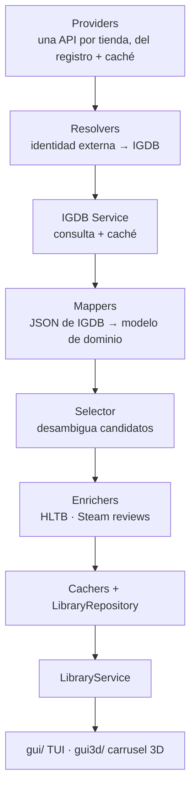

# Arquitectura de Puntueitor 🏗️

Puntueitor unifica bibliotecas de varias tiendas (Steam, GOG, Epic, Amazon),
las identifica contra IGDB, las enriquece con duraciones de HowLongToBeat y
puntuaciones de Steam, y calcula recomendaciones con criterios combinables.

Este documento explica **por qué** el sistema está montado así. Lo que se
puede deducir leyendo el código —qué módulos hay, qué campos tiene cada
clase, qué hace cada función— no está aquí a propósito: esa clase de
documentación se desincroniza a la primera y entonces miente, que es peor
que no existir. Para el "qué", el código; aquí el "por qué".

> Este fichero sustituye a `DOC.md` y a la versión anterior de
> `arquitectura.md`, que eran el mismo documento escrito dos veces y ya
> habían derivado: entre los dos documentaban un módulo `core/index/`, una
> clase `LibraryIndex` y un patrón `CompositeGameScorer` que no existen, un
> campo `steam_score` que en realidad son tres (`steamdb_score`,
> `review_pos`, `review_neg`), una tabla `desconocidos` que se llama
> `unknown_games`, y rutas de datos que cambiaron.

---

## 🏆 La Regla de Oro

Es la invariante central del sistema y de la que dependen el repositorio, la
carga y los dos frontends:

**La tabla `resolvers` es la única fuente de verdad de qué juegos están en
la biblioteca.**

La tabla `games` NO lo es, aunque lo parezca. `games` es la caché global de
*toda* consulta hecha a IGDB, e incluye candidatos de búsqueda descartados
al resolver otros títulos: buscar por título devuelve varios resultados, se
cachean todos y solo se elige uno. Recorrer `games` directamente cuela esos
huérfanos —juegos con carátula pero sin ninguna tienda, que nunca estuvieron
en la biblioteca. Es un error que ya se ha cometido dos veces; la segunda,
en el frontend 3D.

Quien quiera leer la biblioteca debe usar `LibraryRepository.load()`, que
además es el único sitio donde se une todo: resolvers + fichas de IGDB +
extras + estados del usuario.

---

## 🗄️ Separación de datos

Tres clases de datos con dueños y ciclos de vida distintos, deliberadamente
en ficheros separados:

| Dato | Dónde | Se puede regenerar |
|---|---|---|
| Fichas de IGDB (`games`) | `puntueitor.db` | Sí, volviendo a consultar |
| Correlaciones (`resolvers`), extras HLTB/Steam, `unknown_games` | `puntueitor.db` | Sí, pero a base de miles de llamadas |
| Marcas del usuario (`user_games`) | `library.sqlite` | **No** |

Las marcas del usuario (terminado, oculto, pendiente, favorito) viven en su
propio fichero y no mezcladas con la caché de red, precisamente para que
borrar lo segundo no se lleve nunca lo primero por delante.

Las dos bases están en `~/.local/share/puntueitor/`, no en `~/.cache`. El
reparto completo de directorios, y el porqué, está en `core/paths.py`.

Todos los cachers heredan de `BaseCacher`, que aporta conexión por hilo
(SQLite en modo WAL, para que los enrichers puedan escribir desde el pool
mientras la interfaz lee), esquema declarado una sola vez y degradación
controlada: un fallo puntual se registra y sigue, solo un fallo de
inicialización marca el cacher como no disponible.

---

## 🔄 Flujo de carga

`load_library.py` orquesta todo eso sobre un `ThreadPoolExecutor`, con
callbacks de progreso para que la interfaz vaya mostrando resultados en vez
de esperar al final. Con bibliotecas de más de mil juegos la diferencia no
es cosmética.

---

## 🏬 Providers: de dónde salen los juegos

Cada tienda tiene un `LibraryProvider` en `core/providers/`, y los cuatro
hacen lo mismo: piden la biblioteca a la API de la tienda, la guardan en
`StoreLibraryCacher` y la sirven de ahí cuando no se puede llamar. El
pipeline solo recorre proveedores; no sabe si detrás hay HTTP o una copia en
disco.

| Tienda | API | Sesión |
|---|---|---|
| **Steam** | `IPlayerService/GetOwnedGames`, la oficial | API key + SteamID |
| **GOG** | `embed.gog.com`, la del cliente Galaxy | OAuth2 |
| **Epic** | `launcher` + `catalog`, las del Epic Games Launcher | OAuth2 |
| **Amazon** | *entitlements* de Amazon Games | LWA con PKCE + registro de dispositivo |

Tres de las cuatro no están documentadas por su tienda: son las que usan
gogdl, Legendary y Nile, o sea las mismas que había debajo de Heroic cuando
Puntueitor leía sus ficheros. La diferencia es que ahora la sesión es
nuestra y no hace falta que Heroic exista.

**La caché no es una optimización, es la red de seguridad.** Como tres de
las cuatro APIs pueden cambiar sin avisar, `LibraryProvider.fetch()` nunca
devuelve vacío teniendo datos guardados: si no hay conexión, si la sesión
caducó o si la tienda contesta cero juegos, se sirve la última biblioteca
buena y se dice en el log. Un refresco explícito es lo único que la
reescribe, y solo si la respuesta trae juegos.

### Sesiones

`core/auth/` guarda el token de cada tienda en `CACHE_DIR`, igual que el de
IGDB, y lo renueva solo. Iniciar sesión es siempre el mismo gesto —abrir el
navegador y pegar de vuelta la dirección—, incluso en Steam, que
técnicamente podría recoger su OpenID en un servidor local: GOG, Epic y
Amazon tienen su `redirect_uri` fijada hacia un dominio suyo y no hay
`localhost` al que volver, así que o se empotra un navegador entero en la
aplicación o se pega. Hacer Steam distinto solo añadiría un flujo más que
mantener y otro que aprender.

`auth/paste.py` acepta la URL entera, el JSON que enseña Epic o el código
pelado, para que nadie tenga que buscar un parámetro dentro de una URL de
cuatrocientos caracteres.

---

## 🎯 Decisiones de diseño

Estas son las que no se deducen del código, y las que conviene entender
antes de tocar nada.

**`igdb_id: int` como identidad canónica.** Cada tienda tiene su propio
identificador y ninguno sirve fuera de ella. IGDB actúa de eje: todo lo
demás cuelga de ahí, incluidas las marcas del usuario, que así sobreviven a
que un juego cambie de tienda o se compre dos veces.

**`Library` inmutable.** Es una `dataclass` congelada sobre una tupla, sin
lógica de filtrado dentro. Filtrar, ordenar y puntuar son operaciones que
devuelven cosas nuevas, no que mutan la colección. Evita toda una familia de
errores en la que la interfaz y el core dejan de ver lo mismo.

**Los filtros son predicados unitarios (`matches(game) -> bool`), no
operaciones por lotes.** Con un predicado se pueden combinar filtros con AND
y OR trivialmente; con una interfaz `apply(games) -> games` cada composición
hay que escribirla a mano.

**`ScoringContext` y `SelectionContext` están separados** aunque al
principio fueran uno. Llevan cosas distintas y se usan en momentos
distintos: el de selección lleva identificadores de procedencia para
desambiguar (`steam_appid`, `gog_id`, slug, año); el de scoring lleva
preferencias del usuario (horas disponibles, géneros preferidos y odiados).
Juntarlos obligaba a construir un objeto enorme y medio vacío en ambos
casos.

**Los mappers son barrera anticorrupción.** `IGMapperGame` es el único sitio
que sabe cómo es el JSON de IGDB. Si IGDB cambia una clave, se arregla ahí y
el resto del core ni se entera.

**`steampy/` está fuera del core** y es un cliente HTTP puro, con rate
limiting propio (ventana temporal + `threading.Lock`) para no quemar la
clave de API del usuario.

---

## 🤝 `core/services/`: lo que comparten las dos interfaces

Con dos frontends (la TUI y el carrusel), toda operación que no sea dibujar
tiene que vivir en un sitio al que lleguen los dos. Esa es la regla de este
paquete, y su contrato:

- **Nada de Textual ni de Panda3D dentro.** Si un servicio necesitara saber
  cómo se enseña algo, está mal partido.
- **Los errores se devuelven, no se lanzan** (`EnrichResult`, `AdoptResult`,
  `BackupError`): casi todo esto corre dentro de un hilo, y una excepción ahí
  se perdería sin dejar rastro.
- **Los imports pesados van dentro de la función**, no arriba: importar el
  paquete no puede arrastrar la red ni el pipeline entero.
- **Una función con nombre propio por operación, no una con banderas.** En el
  sitio de la llamada tiene que leerse qué se va a perder: `refresh_library`,
  `update_extras`, `enrich_all` y `regenerate_library` hacen cosas parecidas
  con consecuencias muy distintas.

| Módulo | Qué resuelve |
|---|---|
| `library_refresh` | Las cuatro formas de rehacer la biblioteca, de menos a más destructiva |
| `game_actions` | Enriquecer y desconocer un juego suelto |
| `unknown_actions` | Rescatar un desconocido: buscarlo en IGDB o reintentar por tienda |
| `library_ops` | Qué juegos se enseñan según las tiendas activas |
| `store_titles` | Cómo se llama un juego en SU tienda, no en IGDB |
| `backup` | Toda la instalación a un zip, y de vuelta |
| `library_service` | La fachada de scoring, filtrado y ordenación |

Al lado, y por el mismo motivo, `core/diagnostics.py` (traducir un fallo a una
frase que diga qué tocar) y `core/logging_setup.py` (el log, igual para las
dos interfaces).

---

## 🔍 Resolvers: una estrategia por tienda

Esta parte sí merece explicación, porque cada tienda obliga a un truco
distinto y no es evidente por qué:

| Tienda | Estrategia | Por qué |
|---|---|---|
| **Steam** | `external_game_source = 1` + appid | IGDB indexa los appid de Steam directamente |
| **GOG** | `external_game_source = 5` + id de producto | Igual que Steam, con su propia fuente |
| **Epic** | Extrae el *slug* de la URL y busca por él | Epic no tiene correlación de id estable en IGDB |
| **Amazon** | Búsqueda por título + compara fecha de lanzamiento | No hay id ni slug; la fecha es lo que separa secuelas y remakes del original |

Todos caen a búsqueda por título normalizado si su vía principal falla, y de
ahí pasan al `Selector`, que elige entre candidatos combinando la nota del
juego con lo completa que esté su ficha (carátula, sinopsis, duración,
notas). Lo que no se resuelve va a `unknown_games` para no repetir la
búsqueda en cada arranque.

---

## 💎 Patrones

- **Strategy** — scorers, filtros y sorters detrás de `Protocol`s (PEP 544).
  La interfaz cambia de fórmula en caliente sin tocar el motor.
- **Facade** — `LibraryService` es el único punto de contacto para los
  frontends. Ni la TUI ni `gui3d/` conocen cachers ni pipelines.
- **Repository** — `LibraryRepository` esconde que la biblioteca sale de
  cuatro tablas en dos ficheros.
- **Anticorruption layer** — los mappers, arriba.

---

## 🚀 Cómo extender

### Añadir una tienda

Es **escribir su módulo en `core/stores/`** y dos líneas más. El registro
(`core/stores/__init__.py`) es la única lista de qué tiendas hay: los menús de
las dos interfaces, los colores del carrusel, el log, el pipeline y las
sesiones salen de ahí.

1. Crea sus piezas: un `LibraryProvider` en `core/providers/` (solo aporta
   `is_ready()`, `_fetch_remote()` y `store_id()`; la caché y la degradación
   son de la base), un resolver que herede de `BaseResolver` en
   `core/resolvers/`, y —si tiene sesión— su `OAuthSession` en `core/auth/`.
2. Crea `core/stores/<tienda>.py` con su `StoreSpec`: etiqueta, color,
   bandera de configuración, sus tres piezas y qué se le pide pegar al
   usuario. Si no tiene sesión que iniciar, `session=None` (es el caso de
   Steam) y el resto del programa deja de ofrecerle un botón de conectar.
3. Añádela a `REGISTRY` en `core/stores/__init__.py`. **El orden importa**:
   es el de los menús y el de prioridad de color.

Lo único que se queda fuera del módulo son dos líneas que no pueden estar
ahí: el miembro del enum `Stores` (la clave con la que se guardan sus juegos
en la base) y el campo `<tienda>_is_active` en `Config` (lo que se escribe en
`config.json`). `tests/test_stores_registry.py` comprueba que no se olvidan,
en los dos sentidos.

### Añadir una fórmula de puntuación
1. Implementa `GameScorer` en `core/scoring/atomic/` (o en `core/scoring/`
   si compone otras).
2. `score(game, ctx) -> float`, normalizado.
3. Regístrala en `_get_scorer` de `core/services/library_service.py`.

### Añadir un enriquecedor
1. Implementa `GameEnricher` en `core/enrichers/`.
2. `enrich(game) -> Game`, apoyándote en `dataclasses.replace`.
3. Añádelo a la lista de enrichers de `load_library.py`.
4. Si guarda datos nuevos, van a la tabla `extras`, no a `games`: `games`
   es caché de IGDB y se puede borrar entera.

---

## 📎 Documentos relacionados

- `README.md` — instalación, configuración y uso.
- `AGENTS.md` — notas de trabajo: trampas concretas encontradas, cómo se
  midieron y por qué ciertas constantes valen lo que valen. Es donde va lo
  que costó horas averiguar y no se puede reconstruir leyendo el código.
- `CHANGELOG.md` — historial de versiones.
